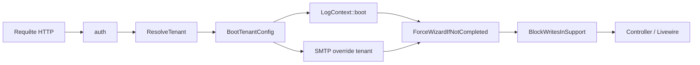

# Architecture multi-tenancy AgoraGestion

## Principe

- Une instance héberge N associations. SVS est le tenant #1.
- Pas de flag `APP_MULTI_TENANT` — le mode multi-tenant est toujours actif.
- Résolution du tenant par session (`current_association_id`), pas par sous-domaine (prévu en v3.1+).
- Toute donnée métier porte une colonne `association_id` — jamais de données partagées entre tenants via Eloquent.

---

## Composants clés

### TenantContext (`app/Tenant/TenantContext.php`)

Singleton statique qui porte l'instance `Association` active pour la requête en cours.

| Méthode | Description |
|---|---|
| `TenantContext::boot(Association $a)` | Initialise le contexte avec l'association résolue |
| `TenantContext::clear()` | Efface le contexte (tests, fin de requête) |
| `TenantContext::current()` | Retourne `?Association` |
| `TenantContext::currentId()` | Retourne `?int` — à utiliser dans toute query raw |
| `TenantContext::hasBooted()` | Vrai si un tenant est actif |
| `TenantContext::requireCurrent()` | Retourne `Association` ou lève `RuntimeException` |

### TenantScope (`app/Tenant/TenantScope.php`)

Global scope Eloquent appliqué automatiquement à tous les modèles étendant `TenantModel`.

Comportement **fail-closed** : si `TenantContext::hasBooted()` est faux (requête non authentifiée, job sans context), le scope injecte `WHERE 1 = 0` — aucune donnée n'est jamais renvoyée plutôt qu'un leak inter-tenant.

```php
// TenantScope::apply() — extraits clés
if (! TenantContext::hasBooted()) {
    $builder->whereRaw('1 = 0'); // fail-closed
    return;
}
$builder->where($model->getTable().'.association_id', TenantContext::currentId());
```

### TenantModel (`app/Models/TenantModel.php`)

Classe parente Eloquent. Tout modèle tenant-scopé doit étendre `TenantModel` (et non `Model`).

- Ajoute automatiquement `TenantScope` via `booted()`.
- Pré-remplit `association_id` à la création si `TenantContext::hasBooted()`.
- Expose la relation `association(): BelongsTo`.

### ResolveTenant (`app/Http/Middleware/ResolveTenant.php`)

Premier middleware de la chaîne : résout le tenant depuis la session ou `users.derniere_association_id`.

Cas traités :

| Situation | Comportement |
|---|---|
| Zone `/super-admin/*` | Aucun boot — les routes super-admin sont tenant-agnostiques |
| Utilisateur non authentifié | Passe sans boot |
| Mode support actif (`session.support_mode`) | Boot depuis `session.support_association_id` sans vérification de pivot |
| Accès normal | Vérifie le pivot `association_user` (non révoqué), boot si OK |
| Association suspendue ou archivée | `abort(403)` pour les utilisateurs non super-admin |

### BootTenantConfig (`app/Http/Middleware/BootTenantConfig.php`)

Second middleware de la chaîne, après `ResolveTenant`. S'exécute uniquement si `TenantContext::currentId()` est non nul.

Actions dans l'ordre :

1. Appelle `LogContext::boot(associationId, userId)` — tous les logs de la requête portent désormais `association_id` et `user_id`.
2. Charge `SmtpParametres` du tenant et écrase la config `mail.*` si SMTP activé.

### ForceWizardIfNotCompleted (`app/Http/Middleware/ForceWizardIfNotCompleted.php`)

Redirige l'admin d'un tenant vers `/onboarding` si `associations.wizard_completed_at` est NULL. Les super-admins et les paths exemptés (login, livewire, assets) ne sont pas concernés.

### BlockWritesInSupport (`app/Http/Middleware/BlockWritesInSupport.php`)

Bloque toute requête mutante (`POST`, `PUT`, `PATCH`, `DELETE`) quand le mode support est actif en session. Seule exception : `super-admin.support.exit`.

### LogContext (`app/Support/LogContext.php`)

Helper qui appelle `Log::withContext(['association_id' => X, 'user_id' => Y])`. Tous les logs Monolog de la requête portent ces champs automatiquement.

### TenantUrl (`app/Support/TenantUrl.php`)

Façade unifiée pour générer des URLs dans les emails, PDFs et webhooks. Aujourd'hui : wrappers transparents sur `route()` / `url()` / `URL::signedRoute()`. En v3.1 (S7), retournera `https://{slug}.agoragestion.fr/…` sans toucher aux appelants.

**Règle :** tout email, PDF, webhook ou réponse publique doit passer par `TenantUrl` — jamais `route()` directement.

### Stockage isolé

Chaque tenant a son répertoire dans `storage/app/associations/{id}/…` — **l'ID numérique, pas le slug** (immuable même si le slug est renommé).

---

## Chaîne middleware (groupe `web`)

Laravel 11 utilise `bootstrap/app.php` (pas de `Kernel.php`). L'ordre d'exécution dans le groupe `web` est :



Middlewares supplémentaires disponibles via alias :

| Alias | Classe |
|---|---|
| `tenant.access` | `EnsureTenantAccess` |
| `boot-tenant` | `BootTenantConfig` |
| `super-admin` | `EnsureSuperAdmin` |

---

## Conventions de code

### Nouveau modèle tenant-scopé

```php
// Bon
final class MonModele extends TenantModel { ... }

// À éviter
final class MonModele extends Model { ... } // pas de scope
```

La migration doit inclure :

```php
$table->foreignId('association_id')->constrained('association')->cascadeOnDelete();
```

### Query brute (`DB::table(…)`)

Toujours filtrer manuellement — Eloquent ne peut pas injecter le scope :

```php
DB::table('ma_table')
    ->where('association_id', TenantContext::currentId())
    ->get();
```

### Nouveau Job

```php
final class MonJob implements ShouldQueue
{
    public function __construct(
        private readonly int $associationId,
        // ...autres props
    ) {}

    public function handle(): void
    {
        $association = Association::findOrFail($this->associationId);
        TenantContext::boot($association);
        // ... logique métier
    }
}
```

Ne jamais compter sur `TenantContext` déjà booté dans un worker — le contexte est vide au démarrage du job.

### URLs dans emails et PDFs

```php
// Bon
TenantUrl::route('factures.show', ['facture' => $id]);
TenantUrl::signed('formulaire.index', ['token' => $t]);

// À éviter
route('factures.show', ['facture' => $id]); // ne sera pas compatible S7
```

### Cache

Les clés de cache doivent inclure l'ID du tenant pour éviter la collision :

```php
Cache::remember("mon-calcul.{$associationId}", 300, fn() => /* ... */);
```

---

## Pièges courants

| Piège | Conséquence | Remède |
|---|---|---|
| Query raw sans filtre `association_id` | Fuite de données inter-tenant silencieuse | Toujours `->where('association_id', TenantContext::currentId())` |
| Job dispatché sans capturer `association_id` | Worker = context vide → scope fail-closed → 0 résultat | Capturer l'ID dans les propriétés du job |
| Clé de cache sans `association_id` | Données d'un tenant retournées à un autre | Inclure l'ID dans la clé |
| `route()` dans un email/PDF | Incompatible avec les sous-domaines S7 | Utiliser `TenantUrl::route()` |
| Test sans boot du contexte | Scope fail-closed → tous les datasets vides | Étendre `TenantTestCase` |
| Accès à un fichier via slug dans le chemin | Slug peut changer si renommé | Utiliser l'ID numérique dans le chemin |

---

## Tests

### TenantTestCase (`tests/Support/TenantTestCase.php`)

Classe de base pour les tests feature qui interagissent avec des ressources tenant-scopées. Boot `TenantContext` avec un tenant de test avant chaque test.

### Suite d'isolation (`tests/Feature/MultiTenancy/Isolation/`)

10+ scénarios qui vérifient que le tenant A ne voit jamais les ressources du tenant B :

- Lecture croisée de tous les modèles principaux.
- Tentative d'écriture via un pivot révoqué.
- Vérification du comportement fail-closed si le contexte n'est pas booté.

### Pest.php global

`tests/Pest.php` intègre le bootstrap global — les tests utilisant `TenantTestCase` héritent du contexte sans configuration supplémentaire.

---

## Observabilité

- Chaque requête authentifiée sur un tenant produit des logs portant `association_id` et `user_id` (via `LogContext`).
- Dashboard super-admin (`/super-admin/`) expose 7 KPIs :

| Clé | Description |
|---|---|
| `kpiActifs` | Nombre d'associations avec statut `actif` |
| `kpiSuspendus` | Nombre d'associations avec statut `suspendu` |
| `kpiArchives` | Nombre d'associations avec statut `archive` |
| `kpiUsersParTenant` | Collection : `association_id` + `total` utilisateurs |
| `kpiStockageMo` | Taille totale `storage/app/associations/` en Mo (cachée 5 min) |
| `kpiJobs` | Nombre de jobs en attente dans la queue |
| `kpiFailedJobs` | Nombre de jobs en échec |

- Actions super-admin (mode support, changements de statut) tracées dans la table `super_admin_access_log`.

---

## Super-admin

### Rôle

L'enum `App\Enums\RoleSysteme` définit deux valeurs :

| Valeur | Constante |
|---|---|
| `'user'` | `RoleSysteme::User` |
| `'super_admin'` | `RoleSysteme::SuperAdmin` |

Vérification : `$user->role_systeme === RoleSysteme::SuperAdmin` ou le helper `$user->isSuperAdmin()`.

### Routes

Toutes les routes super-admin sont préfixées `/super-admin/` et protégées par le middleware `super-admin` (`EnsureSuperAdmin`) :

| Route | Description |
|---|---|
| `GET /super-admin/` | Dashboard KPIs |
| `GET /super-admin/associations/` | Liste des associations |
| `GET /super-admin/associations/create` | Formulaire création |
| `GET /super-admin/associations/{slug}` | Fiche association (model binding par slug) |
| `POST /super-admin/associations/{slug}/support/enter` | Entrer en mode support |
| `POST /super-admin/support/exit` | Quitter le mode support |

### Mode support

- Entrée via `POST /super-admin/associations/{slug}/support/enter`.
- Session : `support_mode = true`, `support_association_id = X`.
- `ResolveTenant` boot le tenant sans vérification de pivot.
- `BlockWritesInSupport` bloque toutes les mutations.
- Bannière rouge affichée dans l'interface.
- Toutes les actions tracées dans `super_admin_access_log`.

### Audit (`super_admin_access_log`)

| Colonne | Type | Description |
|---|---|---|
| `id` | bigint | PK |
| `user_id` | FK → `users` | Super-admin ayant effectué l'action |
| `association_id` | FK nullable → `association` | Association concernée |
| `action` | varchar(60) | Code de l'action |
| `payload` | JSON nullable | Données contextuelles |
| `created_at` | timestamp | Horodatage |
