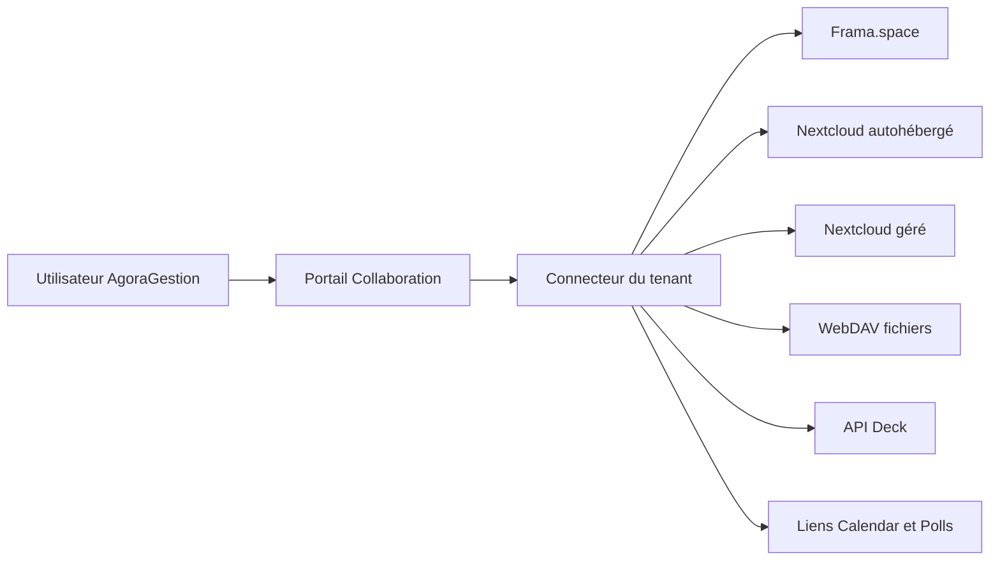

# Couche collaborative et intégration Nextcloud

Date : 20 juillet 2026
Statut : orientation validée, spécification à relire avant planification

## Contexte

AgoraGestion doit pouvoir proposer progressivement des fonctions collaboratives :

- partage et consultation de fichiers ;
- suivi d'actions sous forme de kanban ;
- recherche d'un horaire de réunion ;
- éventuellement consultation des courriels.

L'objectif est d'éviter une juxtaposition d'outils et de comptes, sans réimplémenter une suite collaborative complète.

AgoraGestion n'est actuellement utilisé que par une association. Cette association dispose déjà d'un espace Nextcloud fourni par Frama.space et elle en administre les utilisateurs et les groupes. Framasoft conserve cependant l'administration de la plateforme : l'association ne peut pas installer librement des applications, modifier la configuration serveur ou mettre en place un fournisseur d'identité.

AgoraGestion étant multi-tenant, l'intégration ne doit pas être spécifique à cet espace. Chaque association devra pouvoir configurer son propre serveur Nextcloud, ou ne configurer aucun fournisseur collaboratif.

## Objectifs

- Fournir une entrée cohérente vers les fonctions collaboratives depuis AgoraGestion.
- Utiliser les capacités existantes de Nextcloud pour les fichiers, les versions, les partages et l'édition collaborative.
- Permettre une configuration indépendante pour chaque association.
- Permettre à chaque utilisateur de relier explicitement son compte AgoraGestion à son compte Nextcloud.
- Dégrader proprement l'interface lorsque certaines applications Nextcloud ne sont pas installées.
- Conserver la possibilité d'ajouter ultérieurement d'autres fournisseurs collaboratifs.

## Hors périmètre initial

- Héberger un serveur Nextcloud depuis AgoraGestion.
- Réimplémenter la synchronisation de fichiers, la gestion de versions ou l'édition bureautique collaborative.
- Garantir un SSO complet avec les espaces Frama.space.
- Partager une instance Nextcloud unique entre toutes les associations clientes.
- Développer un client webmail complet dans la première version.
- Synchroniser automatiquement tous les utilisateurs AgoraGestion vers Nextcloud sans consentement ni privilèges administratifs explicites.

## Options étudiées

### 1. Connecteur Nextcloud progressif

Chaque association configure l'URL de son serveur. Chaque utilisateur autorise ensuite AgoraGestion au moyen du Login Flow v2 de Nextcloud. Ce flux fournit un mot de passe d'application propre au client, révocable par l'utilisateur, sans transmettre son mot de passe principal à AgoraGestion.

AgoraGestion utilise ensuite :

- WebDAV pour les opérations sur les fichiers ;
- les API OCS lorsque leur stabilité et les capacités du serveur le permettent ;
- l'API Deck pour afficher des tableaux ou des cartes ;
- des liens contextuels vers l'interface Nextcloud pour les fonctions avancées, Polls, Calendar ou Collectifs.

Cette option fonctionne avec Frama.space sans administration de la plateforme. Elle ne produit pas un SSO complet : l'interface Nextcloud ouverte dans un nouvel onglet peut encore demander une session Nextcloud. En revanche, les fonctions intégrées à AgoraGestion ne redemandent pas les identifiants après l'association initiale.

### 2. Nextcloud maîtrisé avec fournisseur d'identité commun

AgoraGestion et Nextcloud utilisent un fournisseur d'identité OpenID Connect commun, par exemple Authentik, Keycloak ou Zitadel. Cette architecture donne la meilleure expérience de connexion et permet éventuellement le provisionnement automatique.

Elle exige toutefois un accès à la configuration de chaque serveur Nextcloud. Elle n'est donc pas disponible sur l'espace Frama.space actuel. Elle pourra devenir une capacité facultative pour les associations disposant d'un serveur administrable ou d'une offre gérée compatible.

### 3. Fonctions collaboratives natives

AgoraGestion implémente directement les fichiers, le kanban, les sondages de dates et le webmail.

Un kanban léger ou un sondage de dates étroitement lié aux objets métier d'AgoraGestion peut être pertinent. En revanche, le stockage collaboratif et le webmail sont des produits complexes comportant des enjeux de synchronisation, versions, conflits, HTML hostile, pièces jointes, recherche et authentification. Cette option n'est retenue que pour de petites fonctions métier qui apportent une valeur supérieure à une intégration Nextcloud générique.

## Décision recommandée

Retenir l'option 1 comme architecture de départ : un connecteur Nextcloud progressif et multi-tenant. Frama.space constitue le premier cas d'utilisation, mais aucune règle métier ni aucun nom de classe ne doit dépendre de Framasoft.

L'option 2 reste une amélioration facultative pour les serveurs administrables. L'option 3 reste possible, au cas par cas, pour des fonctions métier modestes comme une action attachée à une séance, une dépense ou une campagne.

Les interfaces Nextcloud complètes ne doivent pas être intégrées par `iframe`. Les politiques de sécurité du navigateur, les cookies et les variations de thème rendraient cette solution fragile. AgoraGestion fournit ses propres écrans pour les opérations courantes et utilise des liens explicites pour ouvrir les fonctions avancées.

## Architecture proposée

### Configuration de l'association

Une association peut activer un fournisseur collaboratif et renseigner :

- le type de fournisseur, initialement `nextcloud` ;
- l'URL HTTPS de base ;
- les fonctions qu'elle souhaite exposer dans AgoraGestion ;
- éventuellement les dossiers, tableaux ou liens par défaut ;
- le résultat de la dernière détection de capacités.

Cette configuration est tenant-scopée et doit suivre les règles fail-closed d'AgoraGestion.

### Connexion de l'utilisateur

Un utilisateur relie son compte au fournisseur de son association au moyen du Login Flow v2. AgoraGestion conserve uniquement :

- l'identifiant distant confirmé par Nextcloud ;
- le mot de passe d'application chiffré ;
- la date de connexion et la date du dernier contrôle réussi ;
- l'état de la connexion.

L'association entre comptes est explicite. Une adresse électronique identique ne suffit pas à relier automatiquement deux identités.

L'utilisateur peut révoquer la connexion depuis AgoraGestion. La suppression ou la révocation distante d'un mot de passe d'application doit placer la connexion locale dans un état « à reconnecter » sans empêcher l'accès aux autres fonctions d'AgoraGestion.

### Contrat du connecteur

Le code métier dépend d'un contrat de fournisseur et non directement d'un client HTTP Nextcloud. Le contrat expose des capacités telles que :

- vérifier la disponibilité du fournisseur ;
- obtenir les capacités disponibles ;
- parcourir, envoyer et télécharger des fichiers ;
- obtenir des tableaux et cartes lorsque Deck est disponible ;
- construire un lien sûr vers une application distante.

Une capacité absente ne constitue pas une erreur. Elle masque simplement la fonction correspondante dans l'interface.

## Parcours utilisateur initial

1. L'administrateur de l'association ouvre les paramètres de collaboration.
2. Il saisit l'URL HTTPS du Nextcloud et lance un test de connexion.
3. AgoraGestion vérifie l'hôte et détecte les capacités accessibles.
4. L'administrateur active les entrées pertinentes dans le portail Collaboration.
5. Un utilisateur ouvre le portail et choisit « Connecter mon compte Nextcloud ».
6. AgoraGestion démarre le Login Flow v2 et redirige l'utilisateur vers Nextcloud.
7. Après autorisation, AgoraGestion récupère et chiffre le mot de passe d'application.
8. L'utilisateur retrouve dans AgoraGestion les fonctions prises en charge par son serveur et ses droits.

## Sécurité et isolation

### Secrets

- Ne jamais stocker le mot de passe principal Nextcloud.
- Chiffrer les mots de passe d'application avec le mécanisme de chiffrement Laravel.
- Ne jamais exposer un secret au JavaScript du navigateur, aux logs ou aux messages d'erreur.
- Permettre la révocation locale et distante lorsque l'API le permet.

### Protection SSRF

L'URL étant saisie par un administrateur de tenant, toutes les requêtes sortantes doivent appliquer une politique SSRF stricte :

- HTTPS obligatoire hors environnement de développement ;
- validation et normalisation de l'hôte ;
- refus des adresses locales, privées, de lien local et des métadonnées cloud ;
- nouvelle validation après résolution DNS ;
- redirections désactivées ou revalidées ;
- délais courts et limites de taille ;
- politique réseau sortante restrictive en production lorsque l'infrastructure le permet.

### Multi-tenancy

- Les modèles de configuration et de connexion étendent `TenantModel`.
- Toute tâche asynchrone capture `association_id` et initialise `TenantContext`.
- Les clés de cache incluent l'identifiant de l'association et du fournisseur.
- Un utilisateur ne peut accéder qu'à la connexion distante associée à son adhésion dans le tenant courant.
- Les erreurs distantes ne doivent contenir ni secret ni données provenant d'un autre tenant.

## Défaillances et comportement dégradé

- Serveur indisponible : afficher un état temporairement indisponible sans bloquer AgoraGestion.
- Identifiants révoqués : demander une reconnexion explicite.
- Application absente : masquer la fonction et conserver les autres capacités.
- Réponse lente : interrompre l'appel et proposer l'ouverture directe de Nextcloud.
- API incompatible : désactiver uniquement l'intégration concernée et journaliser la version et la capacité détectées.

Les appels distants non indispensables au rendu principal doivent être mis en cache ou exécutés de manière asynchrone afin qu'une panne Nextcloud ne ralentisse pas l'ensemble d'AgoraGestion.

## Déploiement progressif

### Étape 1 — Portail et configuration

- Configuration Nextcloud par association.
- Test sécurisé de l'URL et détection minimale des capacités.
- Portail Collaboration avec liens configurables.
- Aucun secret utilisateur requis.

### Étape 2 — Association personnelle et fichiers

- Login Flow v2.
- Stockage chiffré du mot de passe d'application.
- Navigation, dépôt et téléchargement via WebDAV.
- Gestion des erreurs et révocation.

### Étape 3 — Aperçu Deck

- Détection de Deck.
- Affichage des tableaux et cartes accessibles à l'utilisateur.
- Liens vers l'interface complète pour les opérations non intégrées.

### Étape 4 — Réunions

- Évaluer l'usage réel de Polls et des propositions Calendar.
- Commencer par des liens contextuels.
- N'ajouter une interface native ou une API que si le parcours par liens est insuffisant et si l'API disponible est suffisamment stable.

### Étape 5 — Identité et messagerie facultatives

- Ajouter une configuration OIDC pour les Nextcloud administrables, sans la rendre obligatoire.
- Traiter le webmail dans une spécification séparée après clarification des fournisseurs IMAP/OAuth et des besoins réels.

Chaque étape doit pouvoir être livrée et utilisée indépendamment. La première planification d'implémentation devra couvrir uniquement l'étape 1 ; les étapes suivantes feront l'objet de décisions séparées après retour d'usage.

## Vérification

Les tests devront couvrir au minimum :

- l'isolation stricte des configurations et connexions entre associations ;
- les autorisations administrateur et utilisateur ;
- le refus des cibles SSRF ;
- le chiffrement et l'absence de secrets dans les logs ;
- les capacités absentes ;
- les erreurs, délais et réponses invalides du serveur distant ;
- la révocation et la reconnexion ;
- les clients HTTP simulés, sans dépendre d'un serveur Nextcloud public dans la suite de tests.

## Références

- [Frama.space : présentation et capacités](https://www.frama.space/abc/fr/)
- [Frama.space : FAQ et migration](https://www.frama.space/abc/fr/faq/)
- [Frama.space : conditions et limites d'administration](https://www.frama.space/abc/fr/csu/)
- [Nextcloud : Login Flow v2](https://docs.nextcloud.com/server/23/developer_manual/client_apis/LoginFlow/index.html)
- [Nextcloud : opérations WebDAV](https://docs.nextcloud.com/server/stable/developer_manual/client_apis/WebDAV/basic.html)
- [Nextcloud : authentification OpenID Connect](https://docs.nextcloud.com/server/latest/admin_manual/configuration_user/user_auth_oidc.html)
- [Nextcloud Deck : API REST](https://deck.readthedocs.io/en/latest/API/)
- [Nextcloud Polls](https://apps.nextcloud.com/apps/polls)
- [Nextcloud Calendar : rendez-vous et propositions de réunion](https://docs.nextcloud.com/server/latest/user_manual/en/groupware/calendar.html)
